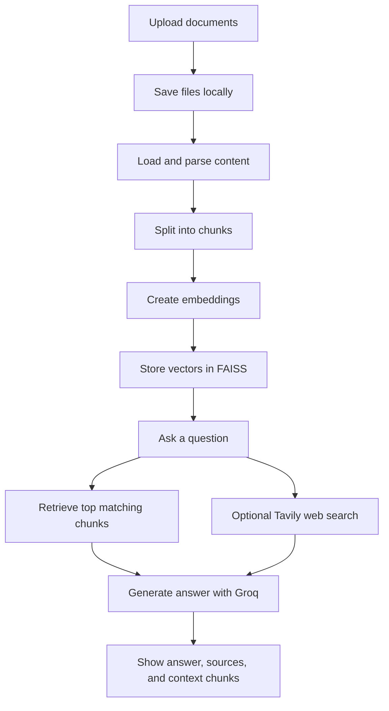
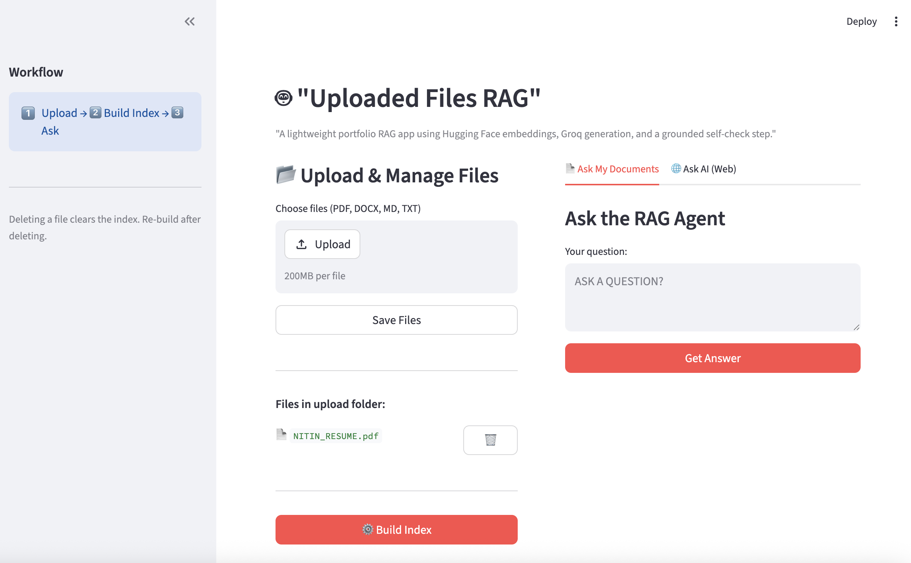
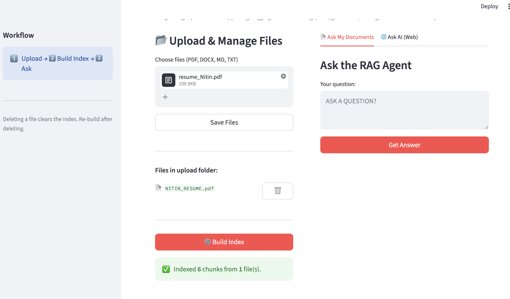
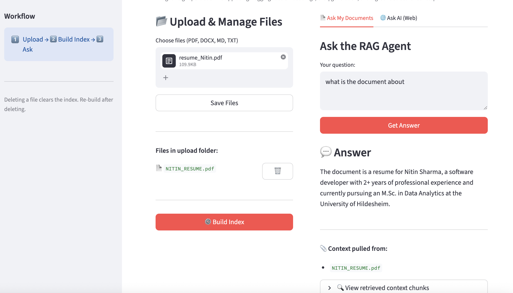
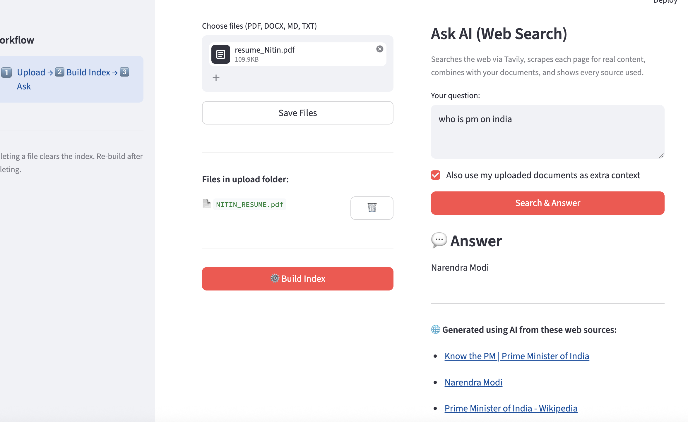

# Uploaded Files RAG

A practical Retrieval-Augmented Generation (RAG) application where users can upload their own files, build a FAISS vector index, ask grounded questions over those documents, and optionally combine that document context with live Tavily web search.

## Live Demo

- Hugging Face Space: [Uploaded Files RAG](https://huggingface.co/spaces/NitinSharmaDS/Rag_With_Tavily)

## Why This Project

Large language models do not automatically know what is inside your private files. This project solves that problem by:

- accepting user-uploaded documents
- splitting them into chunks
- converting those chunks into embeddings
- storing them in a FAISS vector index
- retrieving relevant context for each question
- generating grounded answers with Groq
- optionally enriching responses with Tavily web search

This makes the project useful both as a portfolio RAG demo and as a simple end-to-end reference for document-grounded AI apps.

## Features

- Upload `PDF`, `DOCX`, `MD`, and `TXT` files
- Save uploaded files into the app workspace
- Build a FAISS index from uploaded content
- Ask questions in the `Ask My Documents` tab
- See the answer, supporting source file names, and retrieved chunks
- Use the `Ask AI (Web)` tab for Tavily-powered web search
- Optionally combine uploaded document context with live web results
- Run locally with Streamlit or deploy on Hugging Face Spaces with Docker

## Tech Stack

- Python
- Streamlit
- LangChain
- FAISS
- Hugging Face Embeddings
- Groq
- Tavily Search
- BeautifulSoup + Requests
- Docker
- Hugging Face Spaces

## How It Works



## App Workflow

1. Upload one or more files.
2. Click `Save Files`.
3. Click `Build Index` to create the vector store.
4. Ask a question in `Ask My Documents` for grounded file-based answers.
5. Switch to `Ask AI (Web)` if you want live web search, optionally combined with your uploaded documents.

## Screenshots

### 1. Upload and manage files

Users can upload supported files, save them, and see the uploaded file list in the left panel.



### 2. Build the index

After clicking `Build Index`, the app processes the uploaded files and shows a success message with the number of chunks indexed.



### 3. Ask questions over uploaded documents

The `Ask My Documents` tab returns an answer grounded in the indexed files and also shows the source file plus retrieved context chunks.



### 4. Ask AI using live web search

The `Ask AI (Web)` tab uses Tavily to search the web, scrape source pages, and generate an answer with linked sources.



## Supported File Types

- PDF
- DOCX
- Markdown
- TXT

## Project Structure

```text
Rag_project_hf/
├── app.py
├── Dockerfile
├── requirements.txt
├── assets/
│   └── screenshots/
├── src/
│   ├── main.py
│   ├── logic/
│   │   ├── ingest.py
│   │   ├── rag.py
│   │   └── web_search.py
│   ├── ui/streamlitui/
│   │   ├── loadui.py
│   │   ├── rag_tab.py
│   │   └── web_tab.py
│   └── utils/helpers.py
└── README.md
```

## Local Setup

Install dependencies:

```bash
pip install -r requirements.txt
```

Create a `.env` file in the project root:

```env
GROQ_API_KEY=your_groq_api_key
TAVILY_API_KEY=your_tavily_api_key
```

Optional environment variables:

```env
GROQ_MODEL=llama-3.1-8b-instant
HF_EMBEDDING_MODEL=sentence-transformers/all-MiniLM-L6-v2
RETRIEVAL_K=4
CHUNK_SIZE=900
CHUNK_OVERLAP=150
```

Run locally:

```bash
streamlit run app.py
```

Open the app at:

```text
http://localhost:8501
```

## Docker

Build the image:

```bash
docker build -t uploaded-files-rag .
```

Run the container:

```bash
docker run -p 7860:7860 --env-file .env uploaded-files-rag
```

Open:

```text
http://localhost:7860
```

## Hugging Face Spaces Deployment

This repository is configured as a Docker-based Hugging Face Space.

Required secrets:

- `GROQ_API_KEY`
- `TAVILY_API_KEY`

Note: uploaded files and generated FAISS index data are created at runtime and should not be committed to the repository.

## What This Project Demonstrates

- an end-to-end RAG workflow over private documents
- file ingestion for multiple document formats
- vector search with FAISS
- grounded answer generation with Groq
- hybrid document + web answer generation with Tavily
- simple Streamlit deployment on Hugging Face Spaces

## License

MIT
