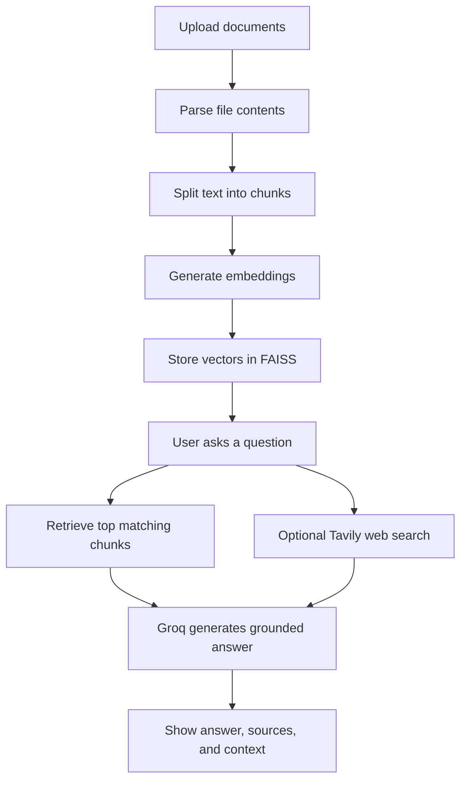

# Uploaded Files RAG

Uploaded Files RAG is a document-grounded question answering application built with Streamlit, LangChain, FAISS, Groq, and Tavily. Users can upload their own files, build a vector index, ask questions over those documents, and optionally combine document retrieval with live web search results.

## Live Demo

- Live app: [Hugging Face Space](https://huggingface.co/spaces/NitinSharmaDS/Rag_With_Tavily)

## Project Overview

This project focuses on Retrieval-Augmented Generation by allowing users to:

- upload their own documents
- convert document content into embeddings
- store and retrieve chunks through FAISS
- generate grounded answers from retrieved context
- optionally enrich responses with Tavily-powered web search

It is designed as a practical RAG portfolio project that shows both document retrieval and real-world deployment.

## Features

- Upload PDF, DOCX, Markdown, and TXT files
- Build a FAISS vector index from uploaded documents
- Ask grounded questions over your own files
- View retrieved source files and context chunks
- Search the web with Tavily for broader answers
- Combine uploaded document context with web results
- Run locally with Streamlit or deploy via Docker on Hugging Face Spaces

## Tech Stack

- Python
- Streamlit
- LangChain
- FAISS
- Hugging Face sentence-transformer embeddings
- Groq LLM
- Tavily Search
- Docker
- Hugging Face Spaces

## Problem Statement

Many users want to ask questions over their own files, but a standard LLM does not automatically know the contents of those documents. This project solves that by turning uploaded files into searchable vector representations and using retrieval to ground the final answer in relevant context.

## How It Works

The app follows a simple RAG workflow:



## Example User Flow

1. Upload one or more supported files.
2. Click `Build Index` to create the FAISS store.
3. Ask a question in the document tab.
4. Review the grounded answer and retrieved source chunks.
5. Optionally use the web search tab to combine live web results with uploaded document context.

## Supported File Types

- PDF
- DOCX
- Markdown
- TXT

## Project Structure

```text
Rag_project_hf/
├── app.py                         # Streamlit app entrypoint
├── Dockerfile                     # Docker deployment for Hugging Face Spaces
├── requirements.txt               # Python dependencies
├── src/
│   ├── main.py                    # Main app loader
│   ├── logic/
│   │   ├── ingest.py              # Document loading, chunking, and FAISS indexing
│   │   ├── rag.py                 # Retrieval and grounded answer generation
│   │   └── web_search.py          # Tavily search and page scraping
│   ├── ui/streamlitui/
│   │   ├── loadui.py              # Main Streamlit layout
│   │   ├── rag_tab.py             # Document Q&A tab
│   │   └── web_tab.py             # Web search + hybrid answer tab
│   └── utils/helpers.py           # Paths, embeddings, and vector store helpers
└── README.md
```

## Run Locally

Install dependencies:

```bash
pip install -r requirements.txt
```

Create a `.env` file:

```env
GROQ_API_KEY=your_key_here
TAVILY_API_KEY=your_key_here
```

Optional configuration:

```env
GROQ_MODEL=llama-3.1-8b-instant
HF_EMBEDDING_MODEL=sentence-transformers/all-MiniLM-L6-v2
RETRIEVAL_K=4
CHUNK_SIZE=900
CHUNK_OVERLAP=150
```

Start the app:

```bash
streamlit run app.py
```

Then open:

```text
http://localhost:8501
```

## Docker Run

Build the image:

```bash
docker build -t uploaded-files-rag .
```

Run the container:

```bash
docker run -p 7860:7860 --env-file .env uploaded-files-rag
```

Then open:

```text
http://localhost:7860
```

## Hugging Face Spaces

This project is configured as a Docker Space and runs Streamlit on port `7860`.

Add these secrets in your Hugging Face Space settings:

- `GROQ_API_KEY`
- `TAVILY_API_KEY`

The app stores uploaded files and generated FAISS data inside the runtime filesystem, so those artifacts should not be committed to the repository.

## Challenges Solved

- building a practical document-grounded RAG workflow
- handling multiple uploaded file formats
- storing and reloading a local FAISS vector index
- combining document retrieval with web search results
- preparing a Streamlit AI app for Docker-based Hugging Face deployment

## License

MIT
