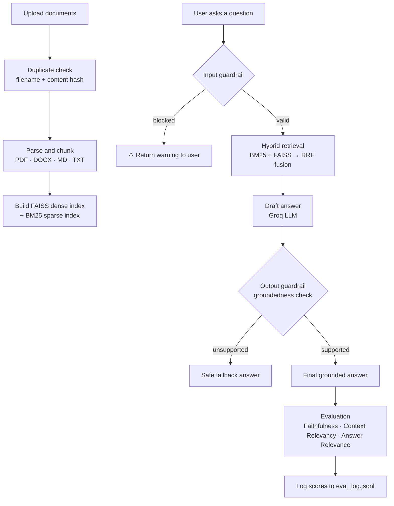

# DocMind — Hybrid RAG with Guardrails & Evaluation

A production-quality Retrieval-Augmented Generation (RAG) application. Upload your own documents, build a hybrid search index, and ask grounded questions — with input guardrails, output groundedness verification, and automatic evaluation metrics on every answer.

| Area | Approach |
|---|---|
| Retrieval | Hybrid BM25 + FAISS, fused with Reciprocal Rank Fusion (RRF) |
| Input safety | Heuristic checks + LLM semantic validation before retrieval |
| Output safety | Groundedness check on every draft answer before returning |
| Quality tracking | Faithfulness, Context Relevancy, Answer Relevance logged per query |
| File management | Duplicate detection by filename and content hash |
| Architecture | Layered logic / ui / utils separation, fully async |

## Live Demo

[Hugging Face Space — Uploaded Files RAG](https://huggingface.co/spaces/NitinSharmaDS/Rag_With_Tavily)

---

---

## Features

**Document handling**
- Upload PDF, DOCX, MD, and TXT files
- Duplicate upload detection — blocks re-uploads by filename and by content hash (catches renamed copies too)
- Per-file delete with automatic index invalidation

**Hybrid retrieval**
- BM25 sparse index + FAISS dense index built in parallel at ingest time
- Reciprocal Rank Fusion (RRF) merges both ranked lists at query time
- Graceful fallback to pure dense search if BM25 index is unavailable

**Two-layer guardrails**
- Input: fast heuristic checks (length, empty) followed by LLM semantic validation — blocks harmful, nonsensical, or purely conversational queries before anything hits retrieval
- Output: groundedness checker verifies that every claim in the draft answer is explicitly supported by retrieved context; unsupported answers are replaced with a safe fallback

**Reference-free evaluation metrics**
- Faithfulness, Context Relevancy, and Answer Relevance scored 0–1 after every answer
- Scores appear inline under each answer and accumulate in a dedicated Evaluation tab
- Persistent JSONL log — averages and per-query history survive across sessions

**Web search tab**
- Tavily-powered web search with real page scraping (BeautifulSoup fallback)
- Optionally combine web results with your uploaded document context

---

## How It Works


```mermaid
flowchart TD
    A[Upload documents] --> B[Duplicate check\nfilename + content hash]
    B --> C[Parse and chunk\nPDF · DOCX · MD · TXT]
    C --> D[Build FAISS dense index\n+ BM25 sparse index]

    E[User asks a question] --> F{Input guardrail}
    F -- blocked --> G[⚠️ Return warning to user]
    F -- valid --> H[Hybrid retrieval\nBM25 + FAISS → RRF fusion]
    H --> I[Draft answer\nGroq LLM]
    I --> J{Output guardrail\ngroundedness check}
    J -- unsupported --> K[Safe fallback answer]
    J -- supported --> L[Final grounded answer]
    L --> M[Evaluation\nFaithfulness · Context Relevancy · Answer Relevance]
    M --> N[Log scores to eval_log.jsonl]
```

---

## Project Structure

```text
Rag_project_hf/
├── app.py                        # Entry point
├── requirements.txt
├── Dockerfile
├── src/
│   ├── main.py                   # Streamlit app loader
│   ├── logic/
│   │   ├── ingest.py             # Document loading, chunking, index building
│   │   ├── hybrid_retriever.py   # BM25 index + RRF fusion
│   │   ├── guardrails.py         # Input validation (heuristic + LLM)
│   │   ├── rag.py                # Full pipeline: guardrail → retrieve → draft → check → eval
│   │   ├── evaluator.py          # LLM-based metric scoring + JSONL logging
│   │   └── web_search.py         # Tavily search + URL scraping
│   ├── ui/streamlitui/
│   │   ├── loadui.py             # Layout, file management, tab wiring
│   │   ├── rag_tab.py            # Ask My Documents tab
│   │   ├── web_tab.py            # Ask AI (Web) tab
│   │   ├── eval_tab.py           # Evaluation metrics tab
│   │   └── uiconfig.py           # App config constants
│   └── utils/
│       └── helpers.py            # Paths, embeddings, vector store loader
└── README.md
```

---

## Tech Stack

- **Python 3.13**
- **Streamlit** — UI
- **LangChain** — document loaders, prompt templates, LLM abstraction
- **FAISS** — dense vector index
- **rank-bm25** — sparse BM25 index
- **HuggingFace Embeddings** — `sentence-transformers/all-MiniLM-L6-v2` (local, no API cost)
- **Groq** — fast LLM inference (Llama 3.1)
- **Tavily** — web search API
- **BeautifulSoup + Requests** — page scraping fallback
- **Docker** — containerised deployment
- **Hugging Face Spaces** — hosting

---

## Local Setup

```bash
pip install -r requirements.txt
```

Create a `.env` file:

```env
GROQ_API_KEY=your_groq_api_key
TAVILY_API_KEY=your_tavily_api_key
```

Optional tuning variables:

```env
GROQ_MODEL=llama-3.1-8b-instant
HF_EMBEDDING_MODEL=sentence-transformers/all-MiniLM-L6-v2
RETRIEVAL_K=4
CHUNK_SIZE=900
CHUNK_OVERLAP=150
```

Run:

```bash
streamlit run app.py
```

Opens at `http://localhost:8501`

---

## Docker

```bash
docker build -t uploaded-files-rag .
docker run -p 7860:7860 --env-file .env uploaded-files-rag
```

Opens at `http://localhost:7860`

---

## Hugging Face Spaces Deployment

Configured as a Docker-based Space. Add these as Space secrets:

- `GROQ_API_KEY`
- `TAVILY_API_KEY`

Uploaded files and generated index data are created at runtime and should not be committed to the repository.

---

## App Workflow

1. Upload files → duplicates are detected and skipped automatically
2. Click **Build Index** → FAISS and BM25 indexes are built in parallel
3. Ask a question in **Ask My Documents** → query goes through input guardrail, hybrid retrieval, draft generation, groundedness check, and evaluation
4. View inline quality scores under the answer
5. Open the **Evaluation** tab to see aggregate metrics and full query history
6. Switch to **Ask AI (Web)** for Tavily web search, optionally combined with your documents

---

## What This Project Demonstrates

- Hybrid retrieval combining sparse (BM25) and dense (FAISS) search with Reciprocal Rank Fusion
- Two-layer safety: LLM-based input guardrails + output groundedness verification
- Reference-free RAG evaluation (faithfulness, context relevancy, answer relevance) without requiring labeled ground truth data
- Async Python architecture with clean separation of concerns across logic, UI, and utility layers
- Content-aware duplicate detection using MD5 hashing
- End-to-end deployment on Hugging Face Spaces with Docker

---

## License

MIT
